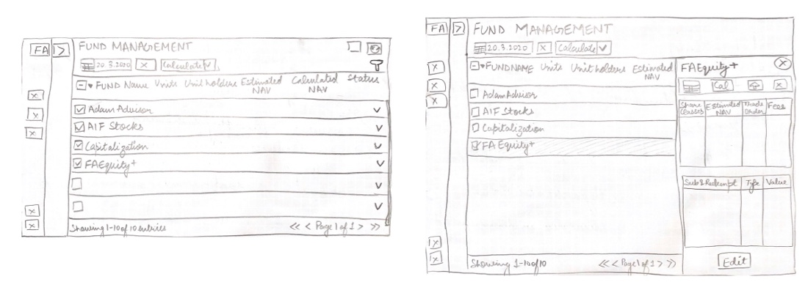
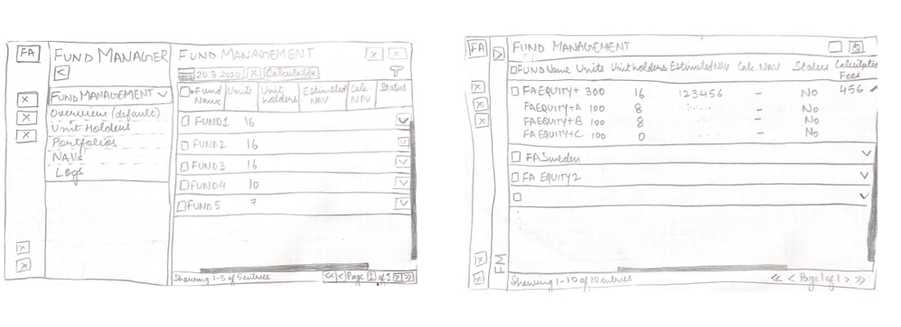
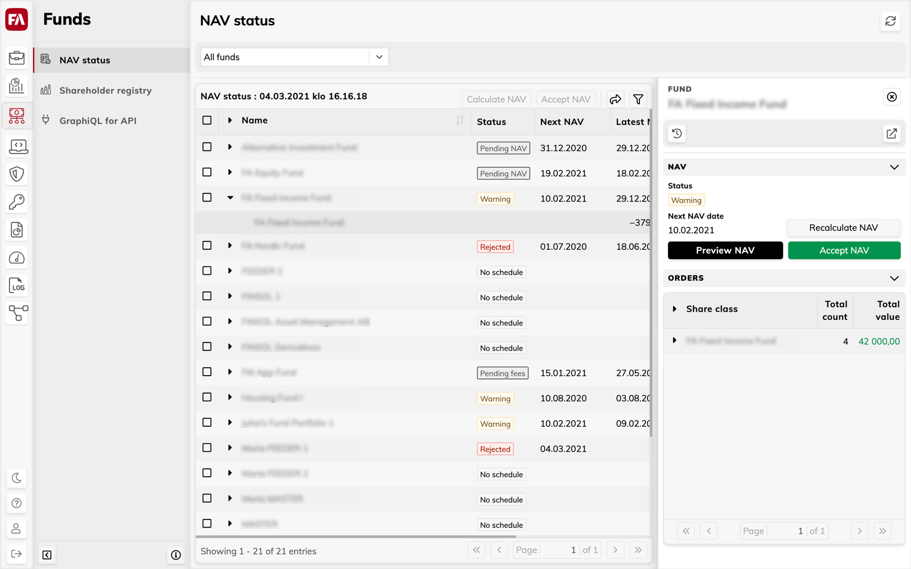
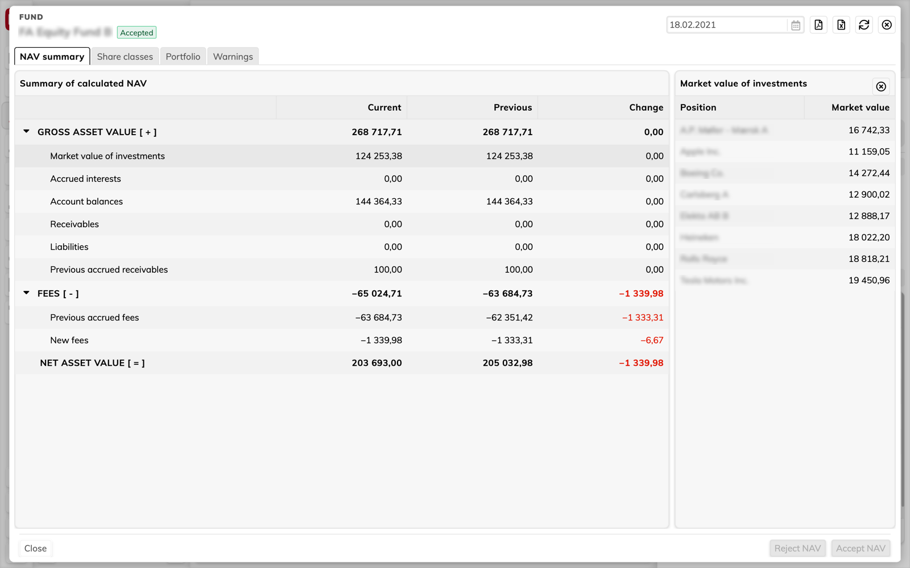
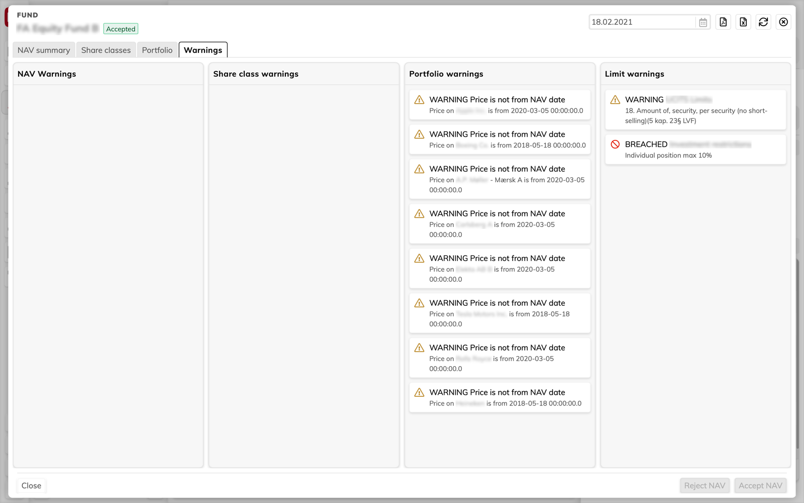
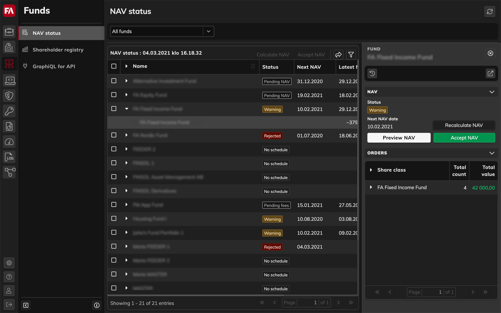
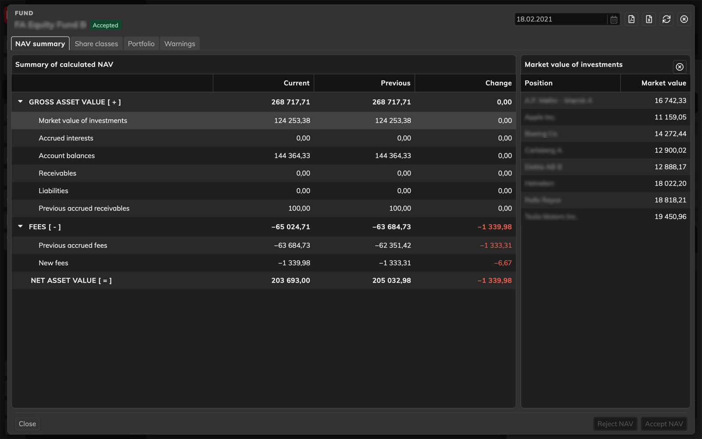
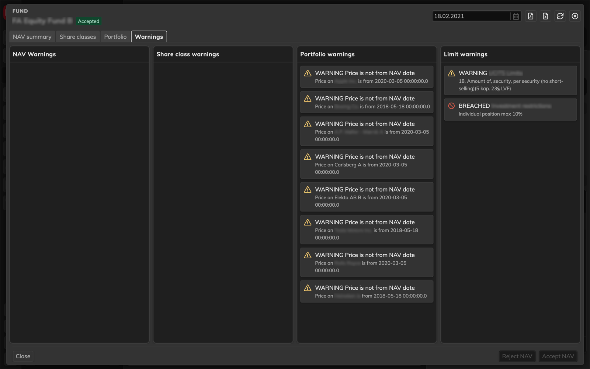

# Fund management

## The Challenge

Currently the fund managers use an extension provided by the company to manage and work with funds and portfolios. The available features have 'overgrown' from what an extension should be and the technology limits what can and should be available in Fund Management process. The challenge was to design an application to provide users with clean interface to perform all their tasks as well as an interface which can accommodate never ending feature updates.

## My Role

Design an application to be used for managing fund portfolios, calculating NAVs, maintaining shareholder registries, and regulatory reporting.

I was involved in all aspects of the product lifecycle, from research to brainstorming, defining the requirements to designing, testing the interfaces, as well as integrating with developers to make sure everything works just right.

## Lean UX approach

Product design and development followed each other in quick succession. Once the components of the application were designed and approved, the development team began implementation.  
I conducted various workshops and testing with the multiple domain experts. The feedback and results were analysed and used for redesigning the existing functionalities of the process. Simultaneously, I designed the next features in the pipeline while working with development team to implement the current features.
The design and testing was incorporated into the development process. The milestones were set quarterly based on the development cycle and the remaining time was used for designing.

## "Think" stage : User Research

The process for managing and working with funds already existed. User interviews and heuristic evaluation was conducted over the existing process to identify major problems and requirements for the design phase.

### User Interviews

Remote and face-to-face interviews were conducted with users with different expertise to know about the issues and problems encountered while using the existing process. There were total 9 participants, 6 male and 3 female belonging to age group 30-60 years.

<!-- Understanding the complexities of the process while providing a design solution which is accessible and has a low learning curve. -->

The user feedback and experience evaluation acted as the base for building new key features for enhancing the user interaction, building better experience and improving the performance time.

<!-- ### Information Structure & Task Flow -->

<!-- Creating information flow and structuring data was of utmost importance as the flow would have a major impact in providing smooth user experience. The structure would also help users to perform tasks in an efficient manner and save time. -->

## "Make" stage : The Design

### Design system

To build harmonious applications across the company, the product team maintains a comprehensive design system. It contains themes (colours, typography, spacing, etc.), components (button, inputs, etc.) and much more.

<!-- Put an image here. -->

To read more about the the design system ["Harmony"](/project/harmony).

### Low-fidelity - Paper prototype

During the brainstorming sessions, paper prototypes were designed to gather early and honest feedback from the users. These paper sketches acted as a foundation in outlining the steps of the user flow or explore and validate a variety of layouts.

### High-fidelity - Figma design

The final designed application is available both in light and dark mode. Screenshot of the final application

**PS: We have dark mode too.**

## "Check" stage : Testing with the Users

The face-to-face testing with users was not possible due to Covid-19 pandemic. The testing was conducted over video meetings where users were given few tasks to perform and they had to think out loud. The tasks were based on users daily work and were followed by interviews. Since the users had their first interaction with the application, their experience and feedback acted as a base for gathering info on the learning curve. New features have been designed from user feedback and experience evaluation.
