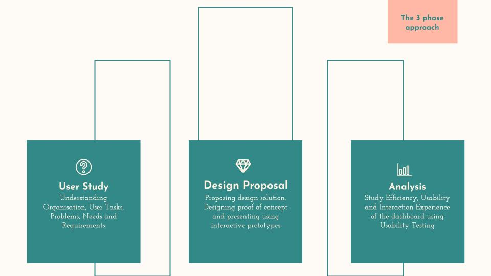
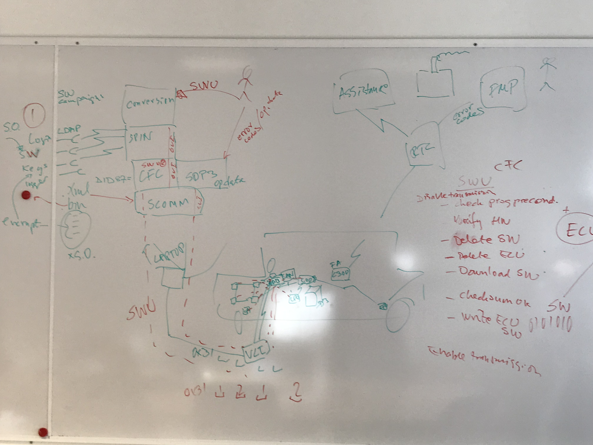
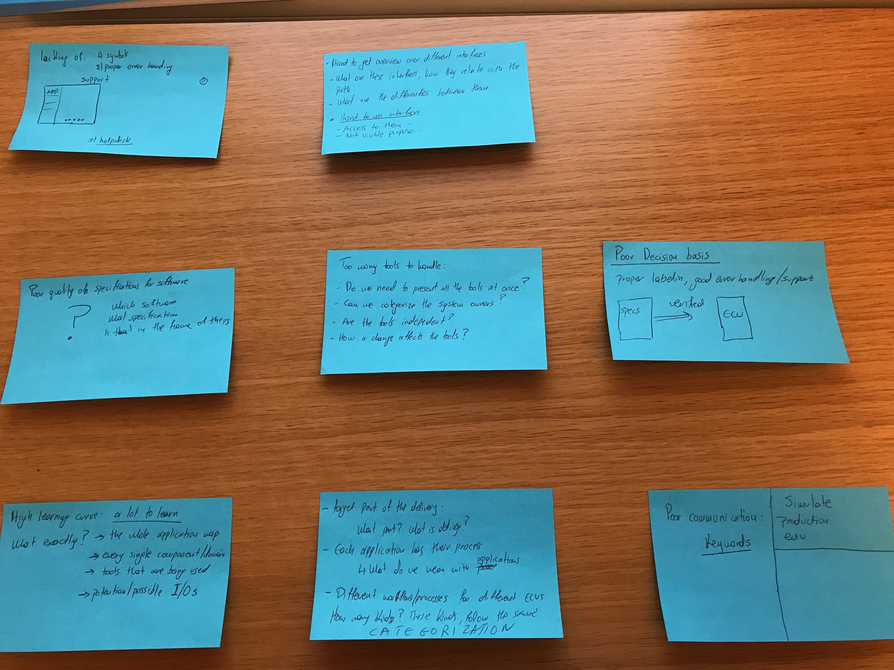
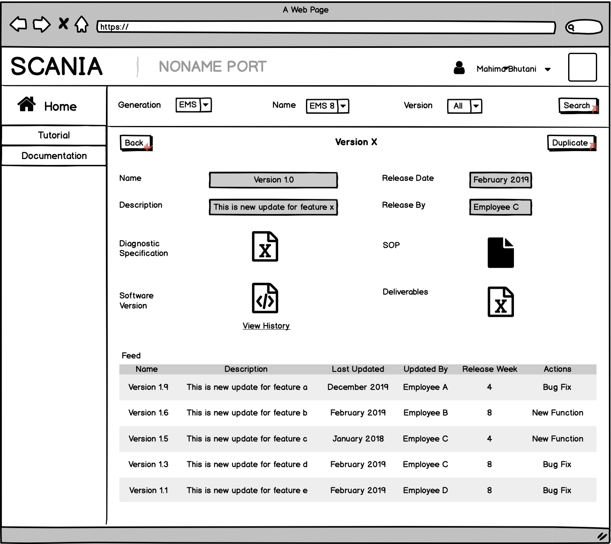
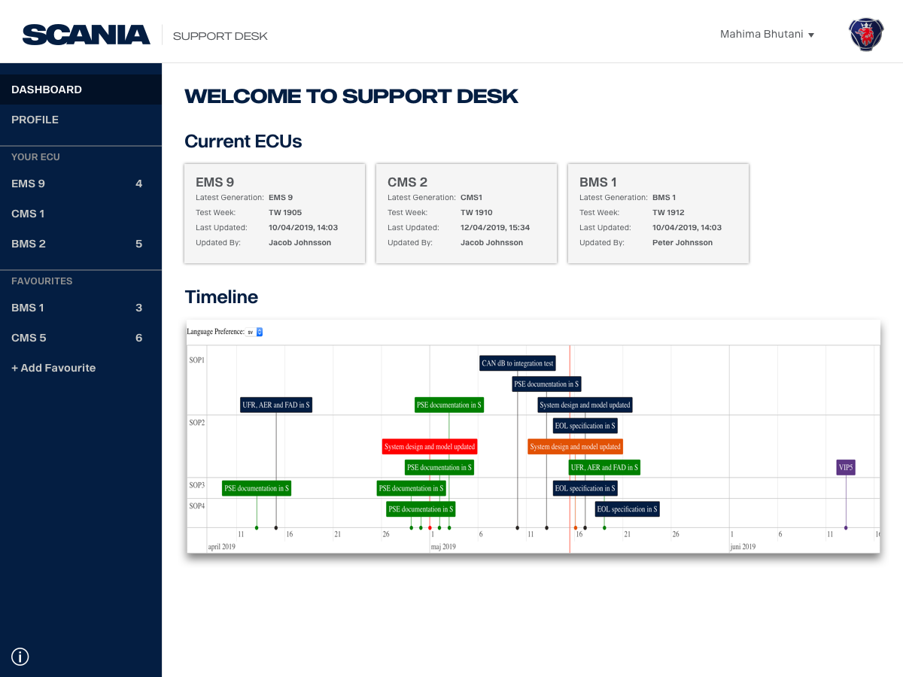
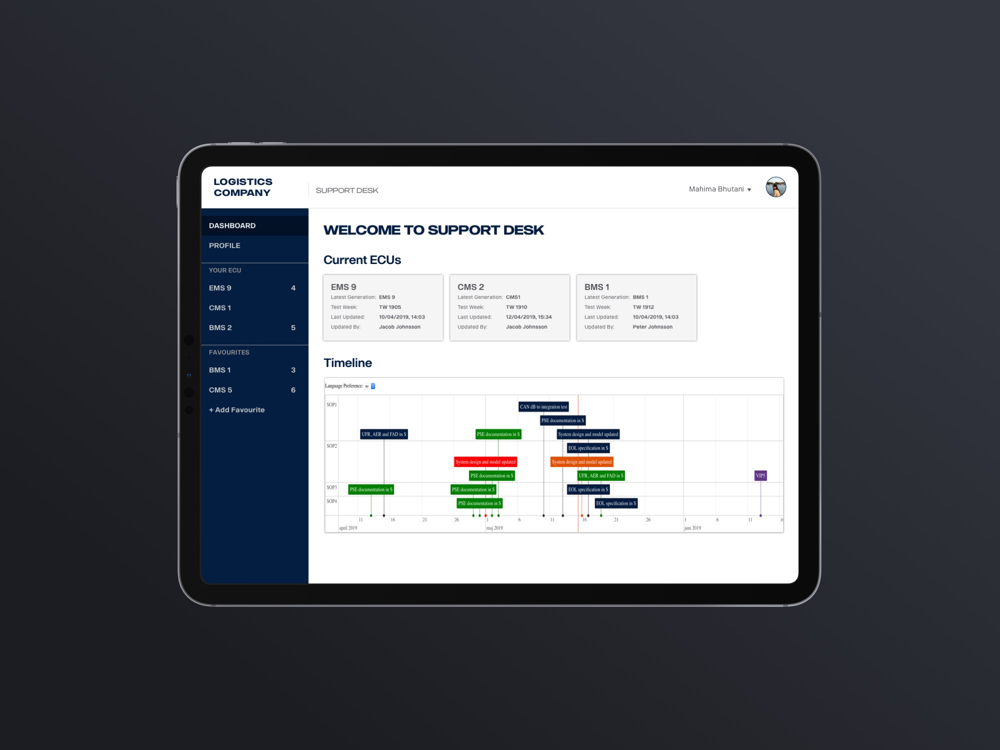
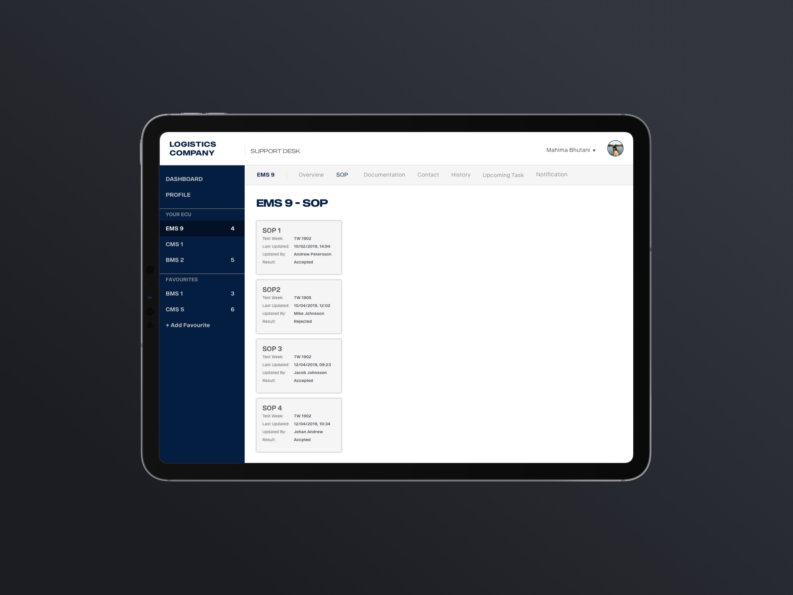
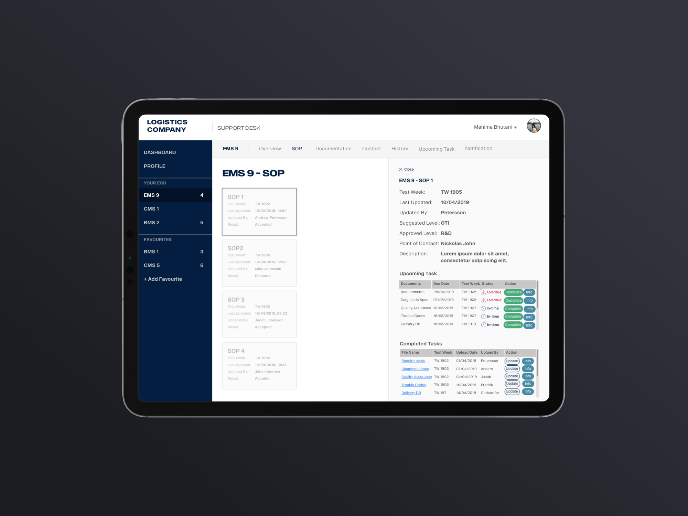
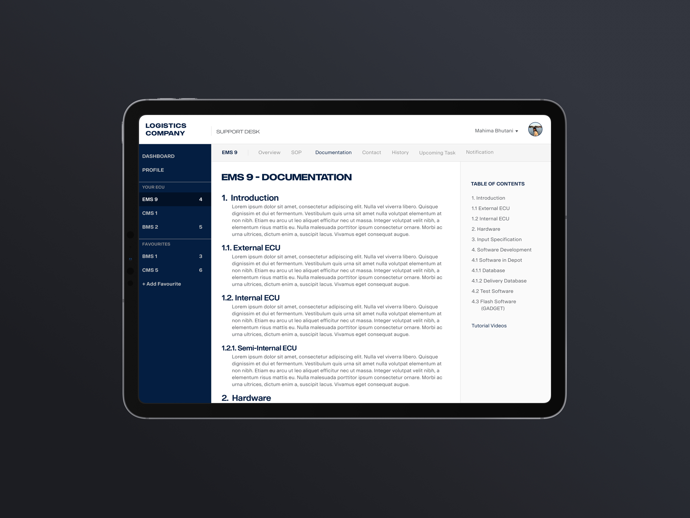
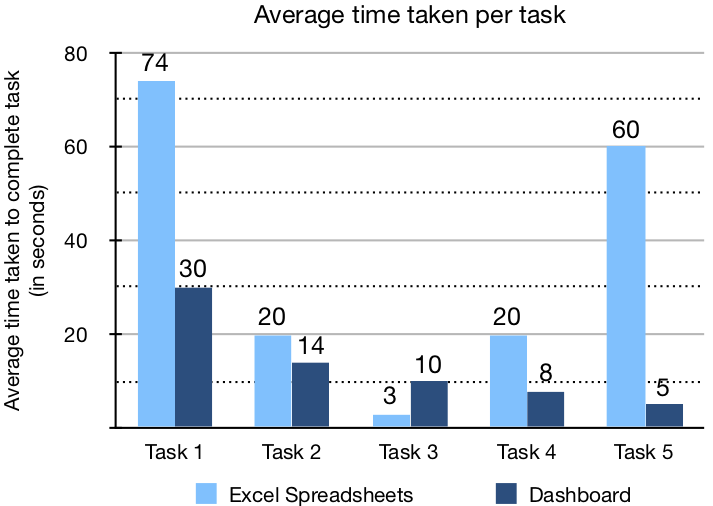

# Scania Logistics Portal

## The background and problem statement

In an industrial setup, the employees had to access information about different processes, procedures and upcoming tasks available in different tools, different departments and from other stakeholders. All this information was gathered and maintained within large spreadsheets (or excel spreadsheets). The employees faced issues in managing the excel spreadsheets which had a negative impact on their overall work process and decision making. A study was conducted to learn more about their problems and needs. Based on research, an information system (dashboard) was proposed and designed to overcome the problems faced by users. The study also focused on evaluating the overall experience of employees while working with dashboard and excel spreadsheets separately.

> "What are the problems encountered by the employees in a complex industrial setting while managing long term projects? In what ways could a dashboard support and enhance the user experience for the employees managing these issues?"

## My role

- Conducted the research, understanding and revealing the underlying problems of using the excel sheets.
- Designed an information management system to be used for gathering information about different processes, procedures and upcoming tasks available in different tools, different departments and from other stakeholders.
- I was involved in all three phases of the case study: user study, design proposal and analysis of the dashboard. This included user research, brainstorming, defining the requirements, designing, testing the dashboard, examining the support provided by dashboard to employees in their day-to day work, and evaluating the user experience of working with the dashboard.

## The dashboard

A Portal for helping people manage their work, view their upcoming tasks, track deliveries and their work and explore history of work done any time in past. This project was done for Master Thesis.

<!--  -->

## The 3 phase approach

### User study

The goal of the semi-structured interviews was to know more about the tools used by employees, context of use, user goals, tasks, needs and requirements. The image below, an employee tried to explain the structure.

**Participants** - The interviews were conducted separately with five users (P1 - P5), all aged between 30 and 60. The participants consisted of _four men and one woman_. The participants belonged to the same technical background and have similar process for performing the tasks although in a different order. Here are some findings of from the interviews conducted.

### Design

The dashboard, was designed using UCD to provide users with all the desired information in one place so they could visualize and retrieve information more efficiently. The system also allowed the users to contact with other stakeholders and departments. The four phases of design were: understand, specify, design and evaluate.

#### Understand and Specify

The focus was to understand the tasks, the process to successfully complete the task and the methods used to perform them. Based on the research, the problems were narrowed down and the requirements were set. It involved:

- All users had different methods or procedures to perform their tasks.
- The users were not aware about the whole task process even after working for more than two years.
- Need for notifications and reminders.
- No records of version handling

#### Design and prototyping

The design phase focused on building the dashboard solution according to the analysis done from previous phase. During this phase the researcher tried to build the solution keeping in mind the users problems and needs. The prototypes were interactive and were proposed for usability testing.

**Low fidelity prototype** - The prototype was presented during the workshop. Based on users feedback, it was detected that few more problems and fields were left out which were then included.

**High fidelity prototype** - The prototype was later used for usability testing. It was designed keeping company’s bootstrap in mind. The users were intrigued to see the designs and were excited to interact with the prototype on their own.

<!--

### SOP

### Details

### Documentation

 -->

#### Evaluate

The usability testing involved performing 5 tasks using both excel spreadsheet and dashboard. The users were encouraged to ‘think out loud’ and at the end of sessions short semi-structured interviews were conducted to know about their experience.

### Analysis and Results

Some of the finding from the usability testing were:

- Time Efficient and Effective
- Quick Decision Making and Planning
- Better Communication
- Simplifies Handover
- Open and Transparent
- User Satisfaction

It was found that using an information system provide better support users in their daily tasks and help in making quick decisions. The users were able to complete their daily tasks effectively without any hassle. This satisfied and relieved the mental stress that gets built when users are not able to complete their tasks and meet deadlines in time.

> The dashboard improved the work time efficiency by 62%

## Future work

In future, the dashboard can be personalised according to the users and their needs. The users can have an option of filtering the desired information.

For detailed description, visit ["Evaluating User Experience while retrieving information via Dashboard"](http://www.diva-portal.org/smash/record.jsf?pid=diva2%3A1362349&dswid=3480).
