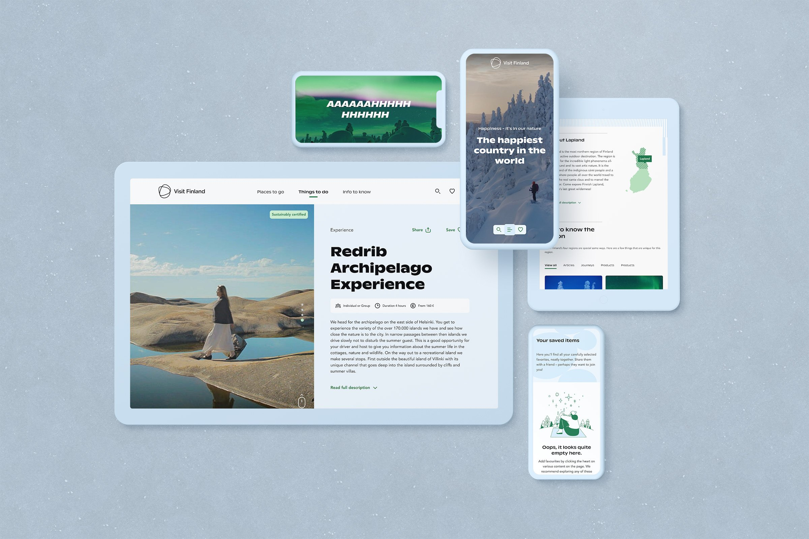
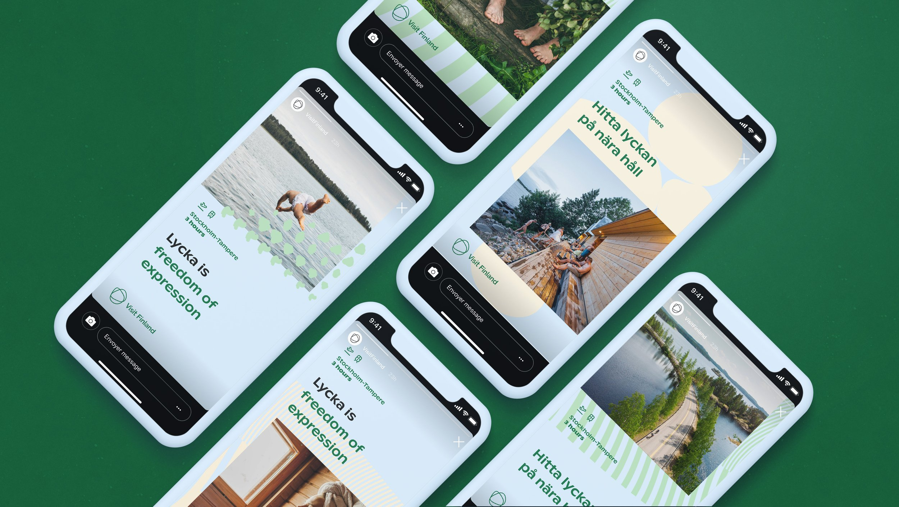
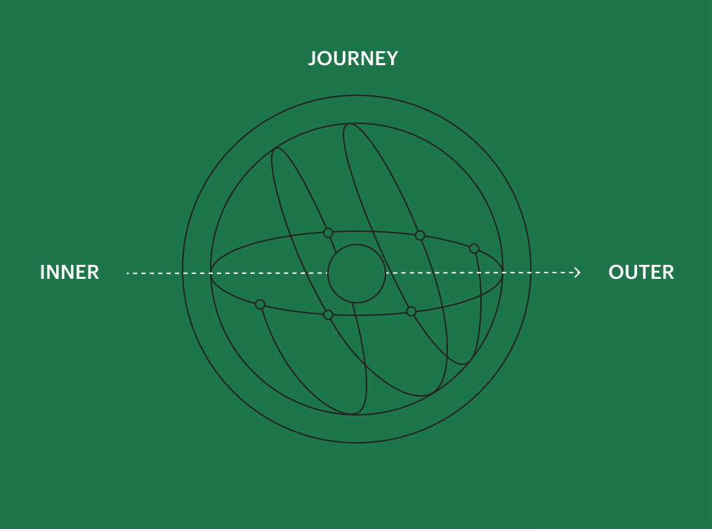

# Visit Finland

## The Website

Tourists are increasingly using the web as a source of travel inspiration and information. Visit Finland, operated by the Finnish Tourism Board, set a goal of making the country the top choice for mindful travellers. Environmental factors and conscious travelling – driven by well-being – are becoming more and more significant in travel. 

We created a brand experience heavily rooted in senses that translates the unique gifts Finland, the happiest country in the world, can share with tourists. A co-creative design process and a scalable visual identity optimised for the digital environment fuel the new version of visitfinland.com – all completed in 1.5 years. The site has welcomed you through 9 languages, 3 B2B sites, and 5 campaign pages. 

## Starting Point

More and more tourists are using the web as a source of inspiration and information. This has increased the demand for a stronger and more interesting digital presence, leading Visit Finland, operated by the Finnish Tourism Board, to partner with us to co-create a differentiated digital brand experience aimed at attracting mindful travellers worldwide. The aim is for visitors to dream of Finland, get inspired by it, and plan their stay.

The new cadence of travel is more deliberate, introspective, and soulful. In addition to environmental factors, conscious travel is increasingly driven by well-being considerations. Empowered by over 5 million people living in the happiest country in the world, we explored the special gifts that Finns can share with the world and translated them into a brand experience heavily rooted in the senses. Whether you encounter Visit Finland in physical or digital environments, it is a sincere invitation for you as our guests to experience the first flavour of Finnish hospitality.

## Strategy

The design of the customer-oriented digital brand experience was shaped through design research methods, user interviews, and co-creation workshops. In the end, over 150 internal and external stakeholders, as well as international travellers from target markets, participated to ensure their voices were reflected.

As the epitome of insightful research, six traveller mindsets were created based on 50 qualitative interviews with key stakeholders and 100 in-depth interviews with international travellers. Providing a comprehensive understanding of travellers, they shed light on new possibilities for better supporting customers with the client's experience offering and helping them to understand how to interact and engage with them.

The new strategy with six guiding principles was investigated: Stay real, Trigger emotions, Be bold, Be adaptable, Be accessible, and Be sustainable. They provide inspiration and direction for meaningful encounters between the user and Visit Finland. Each value has been a critical guideline in both design and content streams to build a scalable and adaptable identity for the digital environment.

  In content design, a holistic information architecture has been reimagined, and the new navigation has been validated through user testing and interviews. A modular and smooth flow of content shows dedication to navigational simplicity.

  Also, the shared vision has been translated into guidelines for creating digital content in a coherent tone of voice. VisitFinland.com is the only digital “host” that offers visually inspiring content as well as concrete information throughout the journey (dream-plan-book-live-share) of international travellers. Therefore, each piece of content brings the visitor one step closer to Finland.
 

  